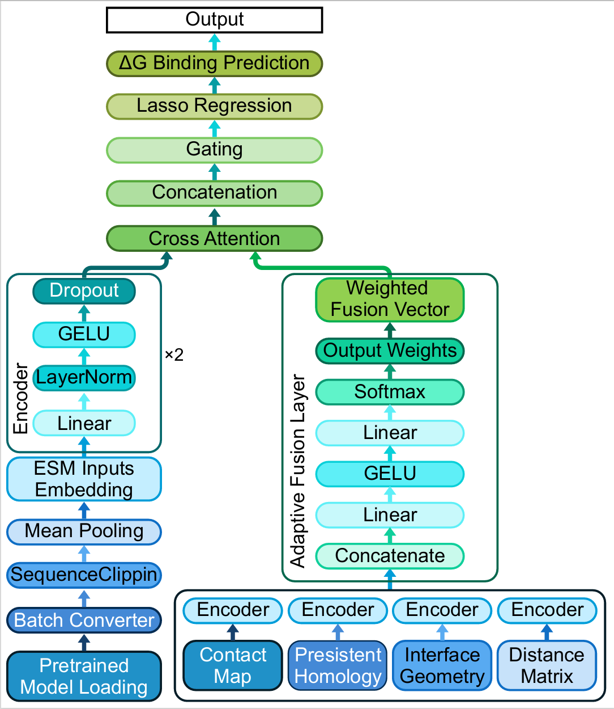

# TopoBind: Multi-Modal Prediction of Antibody–Antigen Binding Free Energy

A deep learning framework for predicting antibody–antigen binding free energy (ΔG) by integrating **ESM-2 embeddings** with **structural topological descriptors**.  
TopoBind leverages cross-attention, adaptive gating, and Lasso regression to achieve state-of-the-art regression and classification performance on antibody–antigen complexes.

---


## 🚀 Features

**Multi-Modal Integration**
- **Sequence embeddings** from ESM-2 (3B model, mean-pooled representations).
- **Topological descriptors** including:
  - Contact statistics  
  - Interface geometry  
  - Distance matrices  
  - Persistent homology features

**Advanced Architecture**
- Cross-attention between sequence and topological embeddings  
- Adaptive gated fusion of multiple structural sub-representations  
- Lasso regression head for ΔG prediction  

**Training & Evaluation Pipeline**
- Custom PyTorch Dataset & DataLoader with normalization  
- Early stopping and learning rate scheduling  
- Lasso regression for downstream analysis  
- ROC and regression metrics evaluation  
- Visualization of loss curves, scatter plots, error distributions, and ROC curves  

---

## 📁 Project Structure
```
TopoBind/
├── src/
│   ├── data/                    # Data loading and preprocessing
│   │   ├── download_pdb.py      # Download raw PDB files from RCSB
│   │   └── prepare_alphafold.py # Prepare antigen/antibody FASTA for AlphaFold/ColabFold
│   └── features/             
│       ├── __init__.py
│       ├── extract_esm_features.py # Extract ESM-2 embeddings (3B) for antibody–antigen sequences
│       └── extract_topo_features.py # Extract scalar topological descriptors (contact, interface, distance, PH)
│   ├── models/                  # Model architecture
│   │   ├── __init__.py
│   │   ├── model.py
│   │   ├── corss_attention.py 
│   ├── training/           # Training utilities
│   │   ├── __init__.py
│   │   └── train.py       
│   ├── evaluation/         # Evaluation metrics
│   │   ├── __init__.py
│   │   └── evaluator.py
│   ├── visualization/      # Plotting utilities
│   │   ├── __init__.py
│   │   └── visualizer.py
├── main.py                 # Main entry point
├── requirements.txt        # Python dependencies
└── README.md              # This file
```


## 🛠️ Installation

### Prerequisites
- Python 3.10+
- CUDA 12.0+ (for GPU support)

### Setup

1. Clone the repository:
```bash
git clone https://github.com/ycy1197/TopoBind.git
cd TopoBind
```

2. Create a virtual environment:
```bash
python -m venv venv
source venv/bin/activate  # On Windows: venv\Scripts\activate
```

3. Install dependencies:
```bash
pip install -r requirements.txt
```

## 📊 Data Preparation

The model expects preprocessed feature files generated from raw PDB complexes:

1. Download PDB structures:
```bash
python download_pdb.py
```

2. Prepare FASTA for AlphaFold/ColabFold (optional):
```bash
python prepare_alphafold.py
```

3. Extract ESM embeddings:
```bsah
python extract_esm_features.py --csv alldata.csv
```

4. Extract topological features:
```bash
python extract_topo_features.py --csv alldata.csv
```

Expected Data Format

Each sample is represented as:

x_esm ∈ R^2560 → ESM-2 embedding (saved in .pkl / .npy)

x_topo ∈ R^d → Topological descriptors (saved in .npz)

y ∈ R → Experimental binding free energy (ΔG)

## 🚂 Training

### Basic Training

```bash
python main.py --mode train
```

### Resume Training from Checkpoint
```bash
python main.py --mode train --checkpoint results/checkpoint.pth
```

### Custom Configuration
```bash
python main.py --mode train --epochs 200 --batch_size 64 --lr 3e-4 --device cuda:0
```

## 📈 Evaluation
### Evaluate Trained Model
```bash
python main.py --mode eval --checkpoint results/best_model.pth
```

### Train and Evaluate in One Run
```bash
python main.py --mode both
```

## ⚙️ Configuration

Key configuration parameters in train.py and model.py:

### Model Parameters

- esm_dim: Dimension of ESM-2 embeddings (default: 2560)

- topo_dim: Dimension of topological feature vector (≈100, percentile-adjusted)

- hidden_dim: Hidden dimension size (default: 256)

- num_heads: Number of attention heads in cross-attention (default: 8)

- dropout: Dropout rate (default: 0.1)

- num_cross_layers: Number of stacked cross-attention layers (default: 2)

### Training Parameters

- batch_size: Batch size (default: 32)

- num_epochs: Maximum epochs (default: 100)

- learning_rate: Initial learning rate (default: 0.0003)

- weight_decay: Weight decay for AdamW optimizer (default: 1e-4)

- patience: Early stopping patience (default: 15)

### Regression Configuration

- lasso_alphas: Range of α values for LassoCV (default: logspace(-4, 1, 30))

- lasso_cv: Number of folds for cross-validation (default: 5)

- lasso_max_iter: Maximum iterations for Lasso solver (default: 10000)

## 📉 Model Architecture

The TopoBind model consists of several key components:

### 1. Sequence Encoder (ESM-2)

Uses pretrained ESM-2 (3B) embeddings

- Feedforward projection to hidden dimension with LayerNorm + GELU + Dropout

### 2. Topology Encoders

- Four sub-encoders for:

-- Contact map statistics

-- Interface geometry descriptors

-- Distance metrics

-- Persistent homology features

- Outputs fused via a softmax-based adaptive gating mechanism

### 3. Cross-Attention Fusion

- Two stacked cross-attention layers

- Bidirectional attention between sequence and topology embeddings

- Each layer includes residual connections, LayerNorm, and feedforward sub-blocks

### 4. Predictor

- Concatenates sequence and topology representations

- Multi-layer perceptron with LayerNorm and GELU

- Outputs binding free energy prediction (ΔG)

- Final regression performed with LassoCV for robust feature selection

## 📊 Results Visualization

The framework automatically generates:
- Training and validation loss curves
- Prediction vs. true value scatter plots
- Error distribution histograms
- ROC curves for classification performance
- Feature importance weights (Lasso and cross-attention)

Visualizations are saved in the `results/` directory.

## 📝 Citation

If you use this code in your research, please cite:

```bibtex
@misc{TopoBind2025,
  title={TopoBind: Multi-Modal Prediction of Antibody-Antigen Binding Free Energy via Sequence Embeddings and Structural Topology}, 
  author={Ciyuan Yu and Hongzong Li and Jiahao Ma and Shiqin Tang and Ye-Fan Hu and Jian-Dong Huang},
  year={2025},
  eprint={2508.19632},
  archivePrefix={arXiv},
  primaryClass={q-bio.BM},
  url={https://arxiv.org/abs/2508.19632}
}
```

## 📧 Contact

For questions or collaborations, please contact:

Email: 72402757@cityu-dg.edu.cn

<!-- ## 🔍 Troubleshooting

### Common Issues

1. **CUDA Out of Memory**:
   - Reduce `batch_size` in config
   - Enable gradient accumulation
   - Use mixed precision training

2. **Slow Training**:
   - Increase `num_workers` in config
   - Enable `pin_memory` for GPU
   - Use SSD for data storage

3. **Poor Performance**:
   - Check data normalization
   - Adjust learning rate schedule
   - Increase model capacity (layers, dimensions) -->

